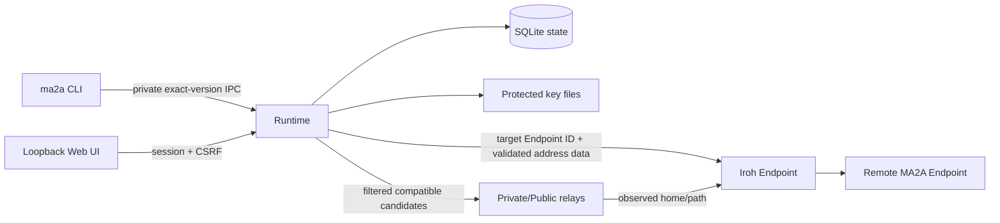

# Architecture

MA2A Phase 1 is endpoint-centric. One current-user Runtime owns one persistent Iroh Endpoint
identity and belongs to zero or more independently authorized Spaces. Space state authorizes
operations; network reachability never grants authorization.

## Ontology

- **Runtime**: one daemon for one current user and state directory.
- **Endpoint**: the persistent Iroh identity owned by that Runtime.
- **Space**: an independently signed authorization domain containing Endpoint memberships. Its
  `SpaceId` is the authoritative identity; its name is shared genesis metadata that every member
  reads from the same signed chain and is deliberately not unique.
- **Address record**: target-specific signed transport data for one Endpoint in one Space.
- **Private Relay advertisement**: signed provider metadata scoped to one Space; it is not target
  address data.
- **Relay candidate**: a URL MA2A has filtered as compatible before supplying it to Iroh.
- **Effective home/path**: current observational state selected and reported by Iroh, not MA2A.

## Control Synchronization

Control synchronization exchanges original signed Space manifests, target address records, and
Private Relay advertisements between already authorized peers. Every object is revalidated against
its exact Space, signer, sequence high-water, validity interval, and target/provider identity before
atomic persistence. Learned revocation changes authorization immediately. Stale, rollback, forked,
cross-Space, and identity-mismatched objects fail closed.

Enrollment is the only bounded zero-Space entry path. A one-time ticket identifies an intended
Space and Endpoint; redemption is atomic and replay-safe. Normal Echo and control operations require
one complete independently authorizing shared Space.

Departure uses the same bounded bootstrap path in reverse: a member asks the Space authority to
sign the next generation removing it, and persists only that authority-signed state. Membership is
therefore only ever changed by the Space authority, never by local deletion.

## Release Boundary

The frontend is built during Rust compilation and embedded into the executable. Release archives do
not contain a source tree, Node runtime, Web asset directory, installer, or updater. The archive,
checksum, SPDX SBOM, dependency/license report, and GitHub OIDC provenance/SBOM attestation bundles
form the release unit.
